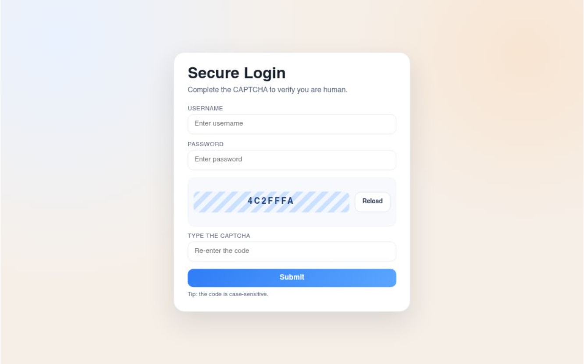

# 🔐 Secure CAPTCHA Login Form

## 📖 Description
This project is a secure login form with a CAPTCHA verification system built using **HTML, CSS, and JavaScript**.  
The CAPTCHA ensures that only human users can submit the form by requiring them to type a generated code correctly.

---

## 🛠️ Technologies Used
- HTML5  
- CSS3 (custom styling & gradients)  
- JavaScript (for CAPTCHA generation and validation)

---

## ✨ Features
- Random CAPTCHA code generation  
- Reloadable CAPTCHA for multiple attempts  
- Case-sensitive validation  
- Clear and modern design  
- Fully responsive layout  

---

## 📁 Project Structure
index.html     → Main HTML structure  
style.css      → Styling for the form and CAPTCHA  
script.js      → JavaScript for CAPTCHA logic and form submission  
README.md      → Project documentation  

---

## ▶️ How to Run the Project
1. Download or clone the repository  
2. Make sure all files (`index.html`, `style.css`, `script.js`) are in the same folder  
3. Open `index.html` in any web browser  
4. Fill in the username, password, and the CAPTCHA code, then click **Submit**  

---

## ⚙️ How It Works
- The CAPTCHA is generated using JavaScript as a random hexadecimal string  
- Users can click the **Reload** button to get a new CAPTCHA code  
- When submitting the form, JavaScript checks if the entered code matches the generated CAPTCHA  
- If correct, the form resets and a success alert is shown; otherwise, an error alert appears  

---

## 🎨 Customization
- Change the CAPTCHA length or style in `script.js` and `style.css`  
- Modify colors, fonts, and gradients in `style.css`  
- Adjust the form structure or add more fields if needed  

---

## 📷 Screenshot (Optional)

---

## 📄 License
This project is free to use for learning purposes  

---

## 🙌 Author
Created by **Suman**